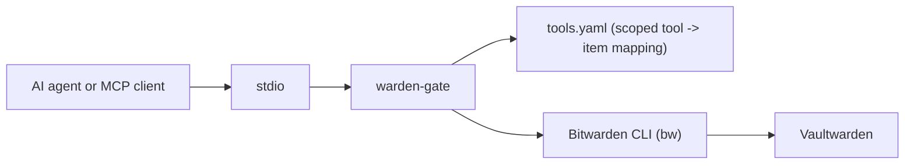

# warden-gate

**Credential-gate MCP server: scoped, purpose-specific tools backed by
Vaultwarden — never a generic "fetch any vault item" tool.**

Fork of [icoretech/warden-mcp](https://github.com/icoretech/warden-mcp)
(MIT licensed): this project keeps its `bw` CLI session/auth plumbing and MCP
transport scaffolding, and replaces its tool-exposure layer entirely. See
[LICENSE](LICENSE) and [`NOTICE`](#notice) below for attribution.

## Why this exists, and why it's not warden-mcp

`warden-mcp` (and every other Bitwarden/Vaultwarden MCP server surveyed while
building this) exposes a **generic vault proxy**: search, get-any-item,
create/update/delete, with secrets redacted unless the caller sets
`reveal: true`. That's the right shape for a human-facing vault client, and
the wrong shape for gating what an AI agent can reach — an agent with a
generic get-item tool is one prompt away from reading anything in the vault.

`warden-gate` instead reads [`tools.yaml`](tools.yaml) at startup and
registers **exactly** the tool names declared there — nothing else. Each tool
is pre-scoped to one Vaultwarden item by config, not by caller input:

- `raw_field` mode returns one named field (e.g. `password`) from one named
  item — last resort, for targets with no way to mint a scoped credential.
- `mint_*` mode fetches a root credential from Vaultwarden internally, never
  returns it, and exchanges it for a short-lived/scoped credential by calling
  the target system's own API (see `src/tools/mintHandlers/`).

Rotating a credential means changing the item in Vaultwarden — `tools.yaml`
never needs to change. Revoking this server's access means pulling its
Vaultwarden automation account.

## Quick Start (stdio)

This is a private, unpublished fork — install it as a checked-out repo, not
an npm package.

Prerequisites:

- Node.js 22.x, npm 10.x
- A Vaultwarden instance and a **dedicated automation account** for this
  server (separate from any other automation account you already run against
  the same Vaultwarden — keep blast radius and rotation independent)
- Either a Bitwarden API key pair or username/password login for that account

```bash
git clone https://github.com/hardKOrr/warden-gate.git
cd warden-gate
npm install
npm run build
```

Edit `tools.yaml` to declare the tools you want exposed (see comments in that
file), then run:

```bash
BW_HOST=https://vaultwarden.example.com \
BW_CLIENTID=user.xxxxx \
BW_CLIENTSECRET=xxxxx \
BW_PASSWORD='your-master-password' \
node bin/warden-mcp.js --stdio
```

Username login also works (`BW_USER` instead of `BW_CLIENTID`/`BW_CLIENTSECRET`).

## Install In MCP Hosts

### Claude Code

```bash
claude mcp add-json warden-gate '{"command":"node","args":["/absolute/path/to/warden-gate/bin/warden-mcp.js","--stdio"],"env":{"BW_HOST":"https://vaultwarden.example.com","BW_CLIENTID":"user.xxxxx","BW_CLIENTSECRET":"xxxxx","BW_PASSWORD":"your-master-password"}}'
```

### Codex

```bash
codex mcp add warden-gate \
  --env BW_HOST=https://vaultwarden.example.com \
  --env BW_CLIENTID=user.xxxxx \
  --env BW_CLIENTSECRET=xxxxx \
  --env BW_PASSWORD='your-master-password' \
  -- node /absolute/path/to/warden-gate/bin/warden-mcp.js --stdio
```

### Ollama (via an MCP bridge)

Ollama has no native MCP client; use a bridge such as
[`mcp-client-for-ollama`](https://github.com/jonigl/mcp-client-for-ollama),
which speaks stdio the same way Claude Code and Codex do above — point it at
the same `node bin/warden-mcp.js --stdio` command and env.

## How It Works



`warden-gate` shells out to `bw` and keeps profile state under
`KEYCHAIN_BW_HOME_ROOT`. Credentials for the server's own Vaultwarden
automation account come from `BW_*` env vars at process start — never from a
tool argument, and never written to a file.

## Configuration

| Variable | Default | Purpose |
| --- | --- | --- |
| `BW_HOST` | required | Vaultwarden origin |
| `BW_PASSWORD` | required | master password for the automation account |
| `BW_CLIENTID` / `BW_CLIENTSECRET` | — | API key login (or use `BW_USER`) |
| `BW_USER` / `BW_USERNAME` | — | username/email login alternative |
| `BW_UNLOCK_INTERVAL` | `300` | seconds between vault unlocks |
| `TOOLS_CONFIG_PATH` | `./tools.yaml` | path to the scoped tool config |
| `KEYCHAIN_BW_HOME_ROOT` | `${HOME}/bw-profiles` | root for per-profile `bw` state |
| `PROXMOX_TLS_INSECURE` | `false` | skip TLS verification in `mint_proxmox_token` for a self-signed homelab cert |

`READONLY`, `NOREVEAL`, `TOOL_PREFIX`, `TOOL_SEPARATOR`, and
`KEYCHAIN_TEXT_COMPAT_MODE` from upstream `warden-mcp` no longer apply — there
is no generic mutating surface left to gate, and tool names come straight
from `tools.yaml`.

## Adding A Tool

1. Add an entry to `tools.yaml` naming the tool, its Vaultwarden item, and
   either `mode: raw_field` (plus `field`) or `mode: mint_<something>`.
2. For a new `mint_*` mode, add one file under `src/tools/mintHandlers/`
   exporting a `MintHandler`, and register it in
   `src/tools/mintHandlers/index.ts`.
3. Restart the server. No other code changes are needed.

## Security Model

- No OAuth, no built-in bearer-token HTTP layer in this fork — v1 ships
  stdio-only, matching how Claude Code, Codex, and Ollama bridges already
  launch local MCP servers.
- The server never accepts vault connection credentials as a tool argument.
- Audit log (stderr): tool name, timestamp, success/failure — never the
  resolved value.
- `mint_*` handlers fetch the root credential from Vaultwarden but never
  return it; only the minted short-lived credential leaves the process.
- The upstream HTTP transport (`src/transports/http.ts`) is still present and
  compiles, but is unused and undocumented here — treat it as dormant until a
  shared-service deployment is deliberately built and reviewed.

## Local Development

| Command | Purpose |
| --- | --- |
| `npm run dev` | watch-mode server from source |
| `npm run build` | compile TypeScript to `dist/` |
| `npm run start` | run the compiled server (HTTP transport) |
| `npm run lint` | Biome autofix plus `tsc --noEmit` |
| `npm run test` | build, then run all compiled tests |
| `npm run test:integration` | build, then run compose-backed integration tests (requires Docker + local Vaultwarden; not exercised while building this fork) |

`src/integration/mcp.e2e.integration.test.ts` still calls the old
`keychain_*` generic tool names inherited from upstream and needs a rewrite
against `tools.yaml`-driven tool names before it will pass — tracked as known
follow-up, since exercising it requires the compose-backed Vaultwarden stack.

## Compatibility

Vaultwarden is the continuously proven target upstream's CI exercises. This
fork has not re-verified CI against a live Vaultwarden; do that before
depending on this in a non-homelab setting.

## NOTICE

This project is a hard fork of
[icoretech/warden-mcp](https://github.com/icoretech/warden-mcp), MIT licensed.
The `bw` CLI service layer (`src/bw/`, `src/sdk/`), transport scaffolding
(`src/transports/`), and build/CI plumbing originate there. The tool
registration layer (`src/tools/registerScopedTools.ts`,
`src/tools/mintHandlers/`, `src/config/toolsConfig.ts`, `tools.yaml`) is new
to this fork and replaces upstream's generic tool surface entirely.
